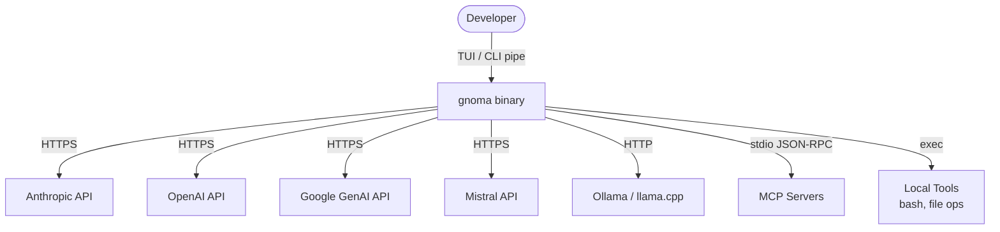
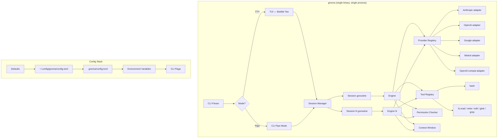
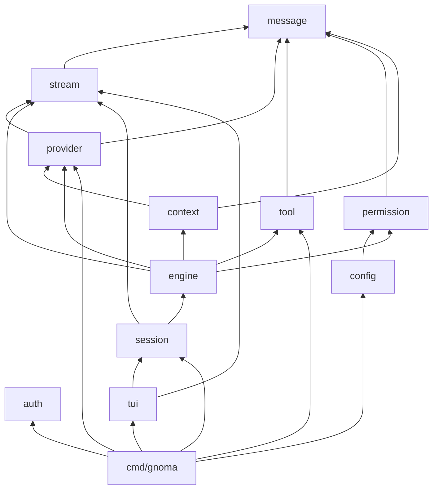

# Architecture

## System Context

## Container View

## Component Overview

| Component | Responsibility | Technology | Boundary |
|-----------|---------------|------------|----------|
| `cmd/gnoma` | Binary entrypoint, flag parsing, mode routing | Go stdlib | Internal |
| `internal/message` | Foundation types: Message, Content, Usage, Response | Pure Go, zero deps | Internal |
| `internal/stream` | Streaming interface, Event types, Accumulator | Depends on message | Internal |
| `internal/provider` | Provider interface, Registry, error taxonomy | Depends on message, stream | Internal |
| `internal/provider/{anthropic,openai,google,mistral}` | SDK adapters: translate + stream | SDK dependencies | Network boundary |
| `internal/provider/openaicompat` | Thin wrapper for Ollama/llama.cpp | Reuses openai adapter | Network boundary |
| `internal/tool` | Tool interface, Registry, bash, file ops | Go stdlib, doublestar | Local system boundary |
| `internal/permission` | Permission modes, rule matching, user prompts | Pure Go | Internal |
| `internal/context` | Token tracking, compaction strategies, sliding window | Depends on message, provider | Internal |
| `internal/config` | TOML layered config loading | BurntSushi/toml | Internal |
| `internal/auth` | API key resolution from env/config | Pure Go | Internal |
| `internal/engine` | Agentic query loop, tool execution orchestration | Depends on all above | Internal |
| `internal/session` | Session lifecycle, channel-based UI decoupling | Depends on engine, stream | Internal |
| `internal/tui` | Terminal UI: chat, input, status, permission dialogs | Bubble Tea, lipgloss | Internal |

## Package Dependency Graph

## Scope

**In scope:**
- Streaming chat with tool execution across 5+ LLM providers
- Agentic loop (stream → tool calls → re-query → until done)
- Permission system for tool execution
- TUI and CLI pipe modes
- TOML configuration with layering
- Context management and compaction
- Multi-agent (elfs) with per-elf provider routing
- Hook, skill, and MCP extensibility

**Out of scope:**
- Web UI (future, via serve mode)
- Cloud hosting / SaaS deployment
- Training or fine-tuning models
- IDE extension authoring (gnoma provides the backend, not the extension itself)

## Deployment

Single statically-linked Go binary. No runtime dependencies. Runs on Linux, macOS, Windows — anywhere Go compiles. Distributed via `go install`, release binaries, or package managers.

## Changelog

- 2026-04-02: Initial version
