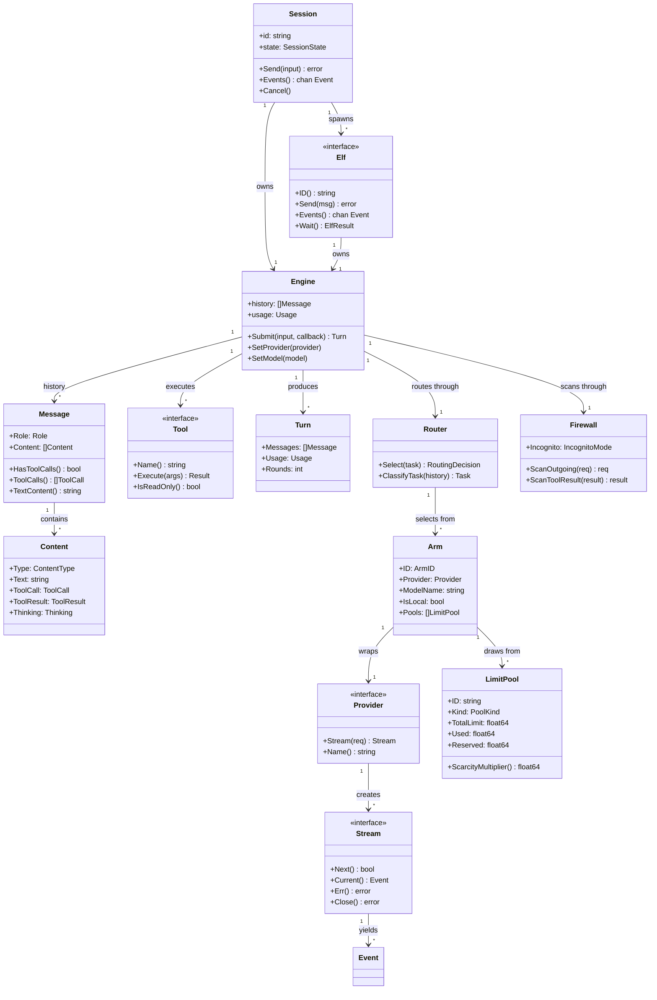

# Domain Model

## Entity Relationships

## Glossary

| Term | Definition | Example |
|------|-----------|---------|
| gnoma | The host application — single binary, agentic coding assistant | `gnoma "list files"` |
| Elf | A sub-agent (goroutine) with its own engine, history, and provider. Named after the elf owl. | Background elf exploring `auth/` on Ollama |
| Session | A conversation boundary between UI and engine. Owns one engine, communicates via channels. | TUI session, CLI pipe session |
| Engine | The agentic loop orchestrator. Routes through firewall and router, executes tools, loops until done. | Engine running via router with 5 tools |
| Router | The smart routing layer. Classifies tasks, selects arms based on quality/cost/scarcity, learns from feedback. | Router picks local Qwen for boilerplate, Claude for security review |
| Arm | A provider+model pair registered in the router. Has capability metadata, pool memberships, and performance stats. | `ollama/mistral-7b`, `anthropic/claude-opus-4` |
| LimitPool | A shared resource budget that arms draw from. Tracks usage with optimistic reservation and scarcity multipliers. | Daily cost cap of 5 EUR shared across API providers |
| Firewall | Security layer that scans outgoing requests and tool results for sensitive data. Manages incognito mode. | Redacts `sk-ant-...` from prompts before sending to API |
| Incognito | Mode where no data is persisted, logged, or fed back to the router. Optional local-only routing. | User toggles incognito for sensitive work |
| Provider | An LLM backend adapter. Translates gnoma types to/from SDK-specific types. | Anthropic provider, OpenAI-compat provider |
| Stream | Pull-based iterator over streaming events from a provider. Unified interface across all SDKs. | `for s.Next() { e := s.Current() }` |
| Event | A single streaming delta — text chunk, tool call fragment, thinking trace, or usage update. | `EventTextDelta{Text: "hello"}` |
| Message | A single turn in conversation history. Contains one or more Content blocks. | User text message, assistant message with tool calls |
| Content | A discriminated union within a Message — text, tool call, tool result, or thinking block. | `Content{Type: ContentToolCall, ToolCall: &ToolCall{...}}` |
| ToolCall | The model's request to invoke a tool, with ID, name, and JSON arguments. | `{ID: "tc_1", Name: "bash", Args: {"command": "ls"}}` |
| ToolResult | The output of executing a tool, correlated to a ToolCall by ID. | `{ToolCallID: "tc_1", Content: "file1.go\nfile2.go"}` |
| Turn | The result of a complete agentic loop — may span multiple API calls and tool executions. | Turn with 3 rounds: stream → tool → stream → tool → stream → done |
| Accumulator | Assembles a complete Response from a sequence of streaming Events. Shared across all providers. | Text fragments → complete assistant message |
| TaskType | Classification of a task for routing purposes. 10 types from boilerplate to security review. | `TaskGeneration`, `TaskRefactor`, `TaskSecurityReview` |
| Callback | Function the engine calls for each streaming event, enabling real-time UI updates. | `func(evt stream.Event) { ch <- evt }` |
| Round | A single API call within a Turn. A turn with 2 tool-use loops has 3 rounds. | Round 1: initial query. Round 2: after tool results. |
| Routing | Directing tasks to different providers based on capability, cost, or latency rules. | Complex reasoning → Claude, quick lookups → local Qwen |
| PersistentTask | A user-confirmed recurring task pattern saved for re-execution. | `/task release v1.2.0` runs the saved release workflow |

## Invariants

Rules that must always hold true in the domain:

- A Message always has at least one Content block
- A ToolResult always references a ToolCall.ID from the preceding assistant message
- A Session owns exactly one Engine; an Engine is owned by exactly one Session
- An Elf owns its own Engine — no shared mutable state between elfs
- The Accumulator produces exactly one Response per stream consumption
- Content.Type determines which payload field is set — exactly one is non-nil
- Thinking.Signature must round-trip unchanged through message history (Anthropic requirement)
- Tool execution only happens when StopReason == ToolUse
- Stream.Close() must be called after consumption, regardless of error state
- Provider.Stream() is the only network boundary — all tool execution is local

## Changelog

- 2026-04-02: Initial version
