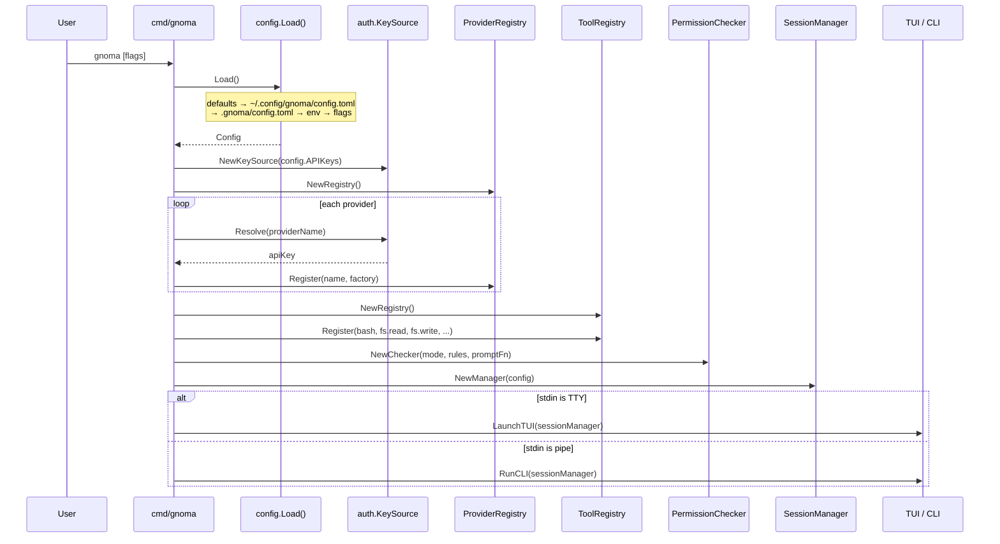
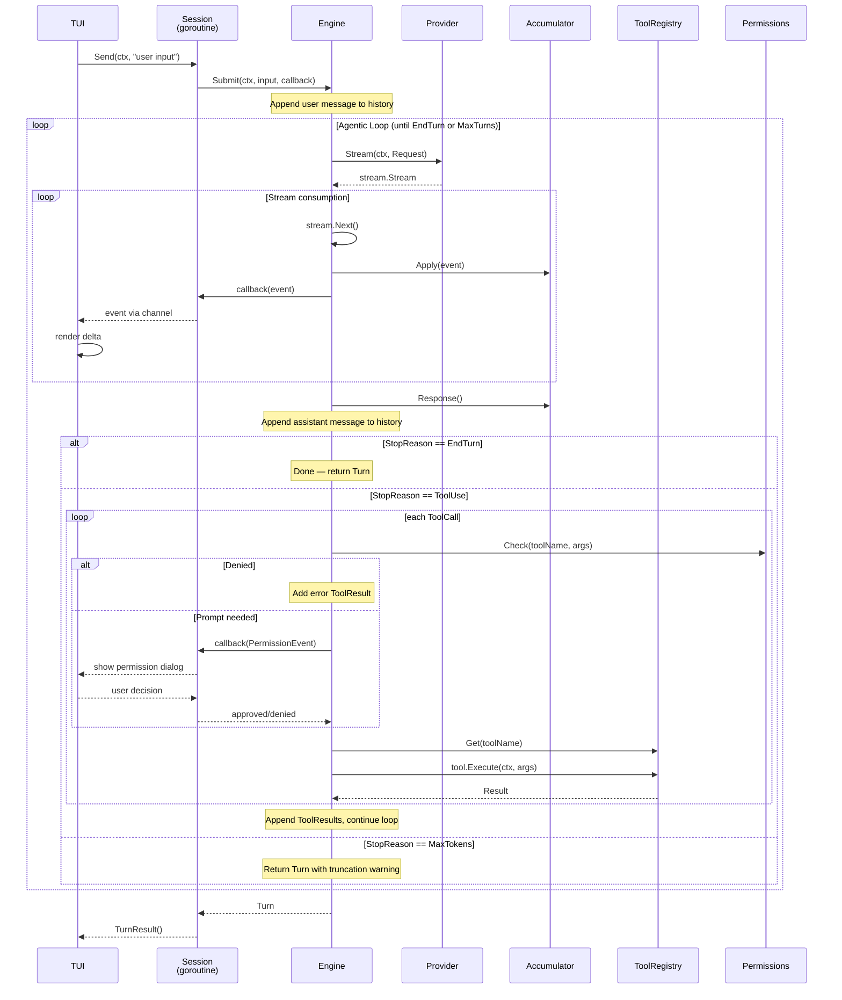
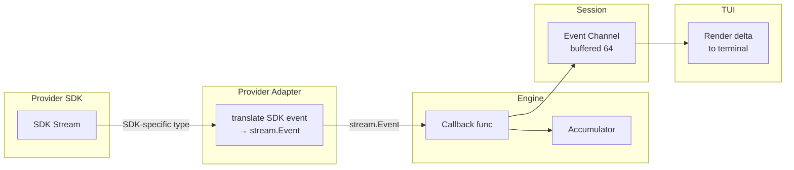
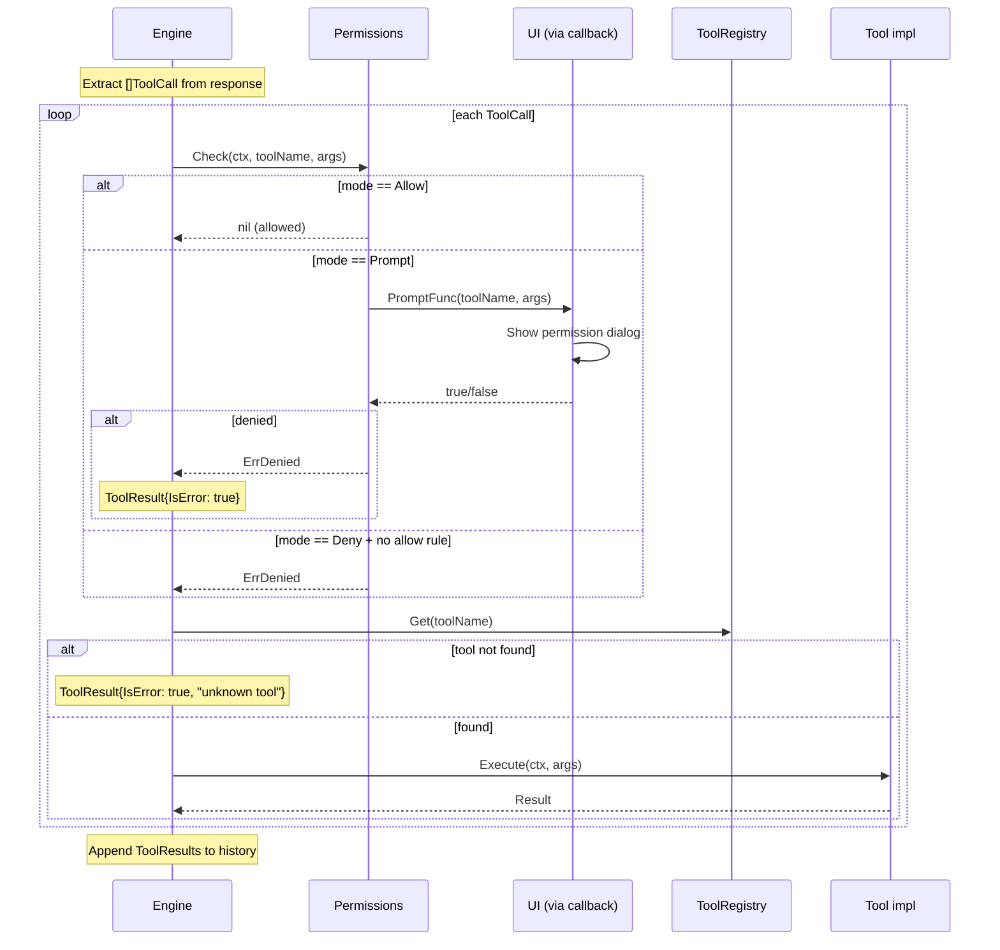
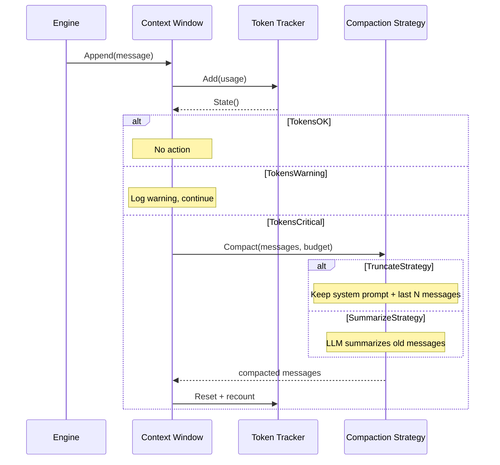
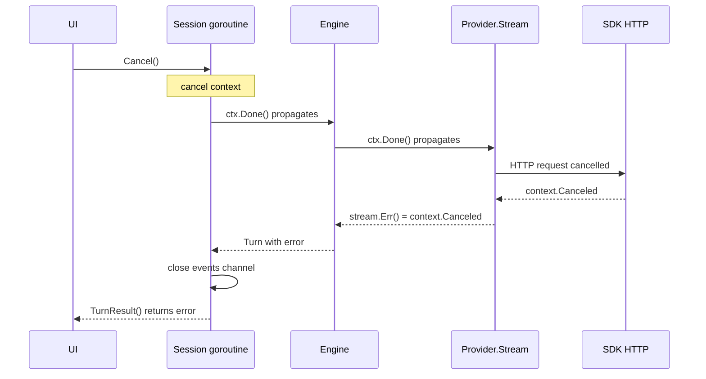

# Process Flows

## Bootstrap / Initialization

## User Message → Response (Full Agentic Turn)

**Happy path:**

**Key decision points:**

- StopReason determines whether the loop continues (ToolUse), ends (EndTurn), or warns (MaxTokens)
- Permission check can block tool execution — denied tools get error results sent back to the model
- MaxTurns is a safety limit to prevent runaway loops

## Streaming Pipeline

## Tool Execution Flow

## Context Compaction Flow

## Cancellation Propagation

## Changelog

- 2026-04-02: Initial version
