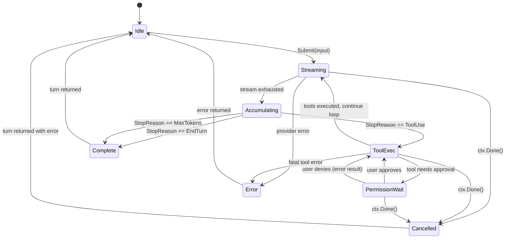
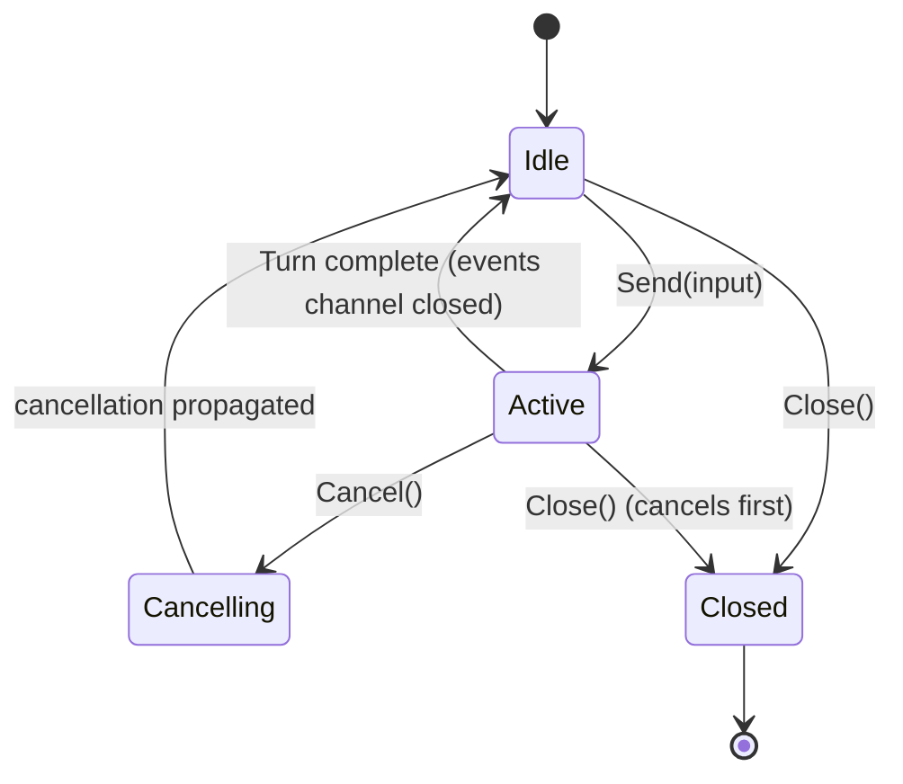
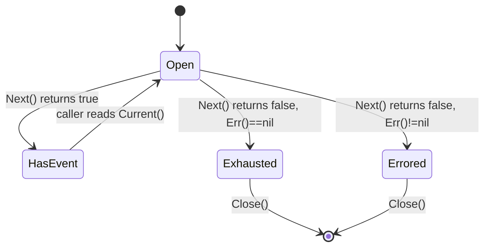
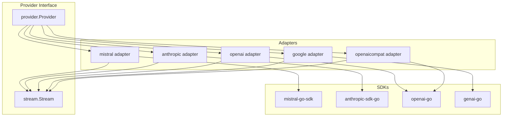
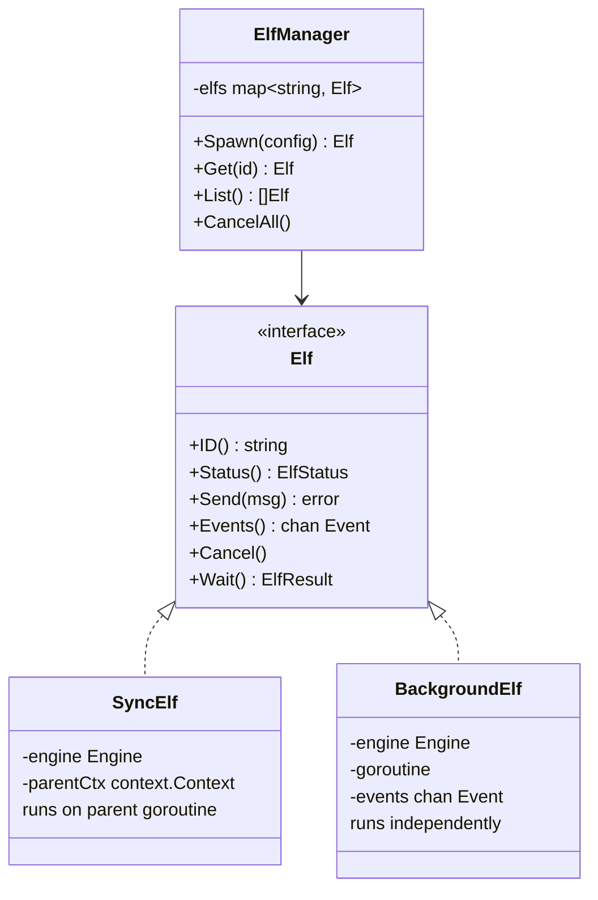

# UML Diagrams

Go doesn't have class hierarchies. These diagrams show struct relationships, interface implementations, and state machines.

## State Diagram: Engine Turn

## State Diagram: Session Lifecycle

## State Diagram: Stream

## Component Diagram: Provider Adapter Stack

## Component Diagram: Streaming Event Translation

```mermaid
graph TB
    subgraph "Anthropic SDK"
        A1[ContentBlockDeltaEvent TextDelta] -->|→| E2[EventTextDelta]
        A2[ContentBlockDeltaEvent InputJSONDelta] -->|→| E3[EventToolCallDelta]
        A3[ContentBlockDeltaEvent ThinkingDelta] -->|→| E4[EventThinkingDelta]
        A4[ContentBlockStartEvent tool_use] -->|→| E1[EventToolCallStart]
        A5[ContentBlockStopEvent] -->|→| E5[EventToolCallDone]
    end

    subgraph "OpenAI SDK"
        O1[Chunk.Delta.Content] -->|→| E2
        O2[Chunk.Delta.ToolCalls start] -->|→| E1
        O3[Chunk.Delta.ToolCalls delta] -->|→| E3
        O4[Chunk.FinishReason=tool_calls] -->|→| E5
    end

    subgraph "Google SDK"
        G1[Response.Part.Text] -->|→| E2
        G2[Response.Part.FunctionCall] -->|→| E1
        G3[same FunctionCall] -->|→| E5
    end

    subgraph "Mistral SDK"
        M1[Chunk.Delta.Content] -->|→| E2
        M2[Chunk ToolCalls start] -->|→| E1
        M3[Chunk ToolCalls delta] -->|→| E3
        M4[Chunk.FinishReason=tool_calls] -->|→| E5
    end
```

## Struct Relationships: Elf System (Future)

## Changelog

- 2026-04-02: Initial version
